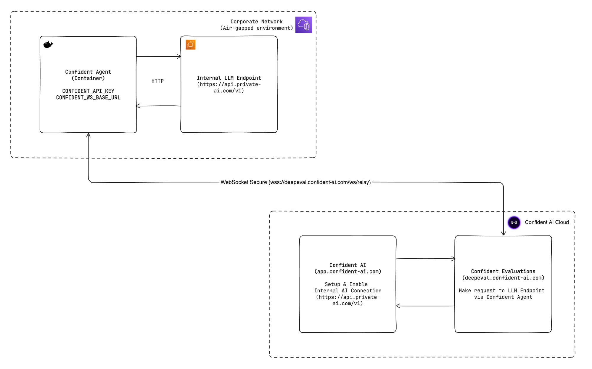

# Confident Agent

A lightweight agent that connects your private network to Confident AI's evaluation server — without opening inbound ports. It runs in one of two modes:

- **Forwarding mode** (default): requests are forwarded through the agent's outbound WebSocket tunnel to an internal API endpoint, and responses are relayed back.
- **Handler mode**: for AI apps with **no HTTP endpoint**. You write a small `@handler` function; the agent runs it locally for each evaluation input and relays the output back.

## How it works

The agent connects outbound via WebSocket Secure (WSS) to Confident AI's evaluation server and waits for work. When an evaluation runs, each request is either forwarded to your internal endpoint (forwarding mode) or passed to your handler function (handler mode).

Forwarding mode supports HTTP Response, HTTP Streaming and SSE Streaming response modes.

## Getting started

The Python implementation lives in [`python/`](python/) — see its [README](python/README.md) for setup, configuration, and usage.
